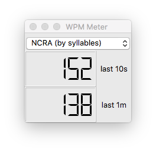

# About

This is a plugin for Plover to display your typing speed, in words per minute,
as you type. Words per minute is calculated by finding the number of syllables
that you've typed and converting it to words using the ratio of 1.44 syllables
per word, on average.

It looks like this:



# Installation

To install this plugin, you'll need to build Plover from source, then install
this package with an invocation something like this:

```
pip install git+git://github.com/arxanas/plover_wpm_meter
```

Then launch Plover and select the WPM meter from the tools.

# License

This plugin is licensed under the GPLv3.
